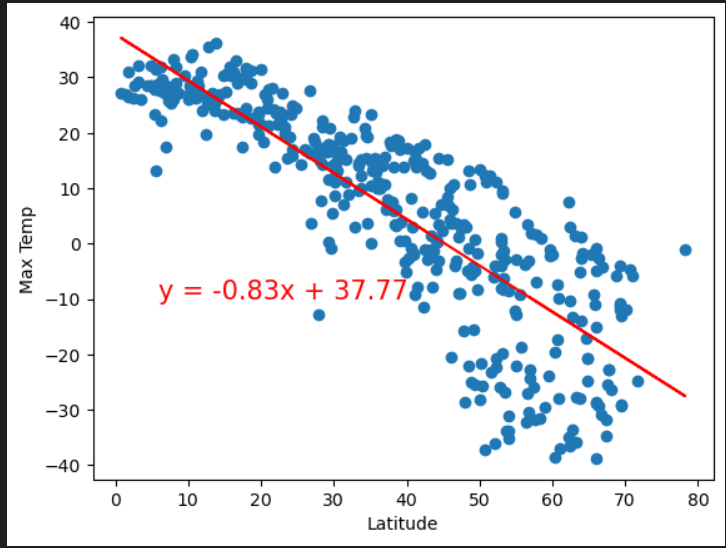
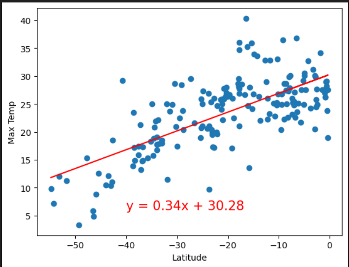
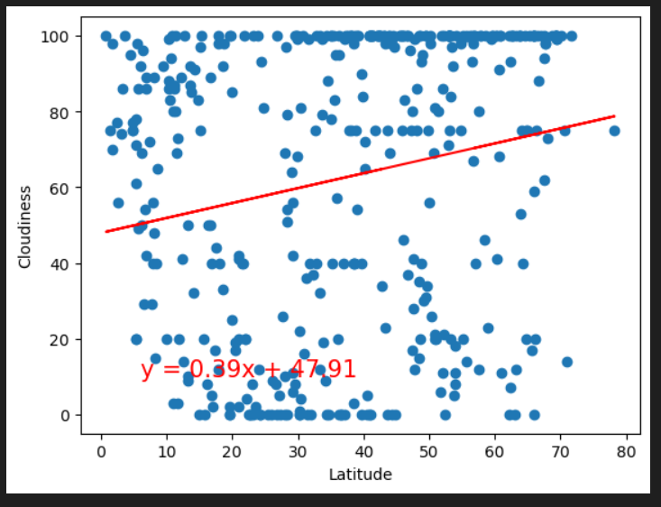
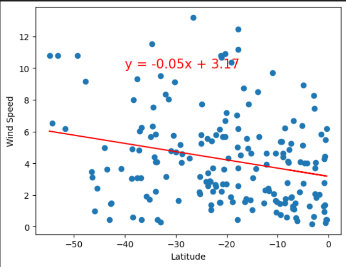

Python script to visualize the weather of 500+ cities across the world of varying distance from the equator using CityPy, a simple Python library, and the OpenWeatherMap API.

The visualizations includce a series of scatter plots to showcase the following relationships:

Temperature (F) vs. Latitude Humidity (%) vs. Latitude Cloudiness (%) vs. Latitude Wind Speed (mph) vs. Latitude

The script accomplishes the following:

Randomly selects at least 500 unique (non-repeat) cities based on latitude and longitude.

Performs a weather check on each of the cities using a series of successive API calls.

Includes a print log of each city as it's being processed with the city number and city name.

Saves both a CSV of all data retrieved and png images for each scatter plot.

Observable Trends

The Max Temperature vs. Latitude plot for cities in the northern hemisphere is shown above. 
The max temperature appears show a strong negative linear relationship with latitudes in the northern hemisphere, 
with an r-value of -0.86 for the linear best-fit regression line.
The higher the latitude degree lower the max temprature and Lower the latitude degree higher the max temprature
It has negative coefficient indicates there is negative linear relationship

The Max Temperature vs. Latitude plot for cities in the Southern hemisphere is shown above. 
with an r-value of  for the linear best-fit regression line.
The higher the latitude degree higher the max temprature and vice versa
It has positive coefficient indicates there is positive linear relationship
  
  

The Max Humidity vs. Latitude plot for cities in the northern hemisphere is shown above. 
The max Humidity appears show a strong positive linear relationship with latitudes in the northern and southern hemisphere, 
with an r-value of   or the linear best-fit regression line.
The higher the Humidity and higher the latitude degree for northern and sothern hemispere
It has positive coefficient indicates there is positive linear relationship
  
  

The Max cloudiness vs. Latitude plot for cities in the northern hemisphere is shown above. 
The max clousiness appears show a strong positive linear relationship with latitudes in the northern and southern hemisphere, 
with an r-value of   or the linear best-fit regression line.
The higher the latitude degree the higher the cloudiness in northern and sothern hemispere 
and lower the latitude degree lower the cloudiness in northern and sothern hemispere 
It has positive coefficient indicates there is positive linear relationship
  
  
The wind speed vs. Latitude plot for cities in the northern hemisphere is shown above. 
The higher or the lower the latitude the cloudiness remain constant in the northern hemisphere, 
with an r-value of -0.62 for the linear best-fit regression line.
there is no impact on wind speed with higher or lower the latitude degree.

The wind speed vs. Latitude plot for cities in the southern hemisphere is shown above. 
The higher the latitude degree lower the wind speed the impact on wind speed with the change in latitude degree is very low
The negative value of slope indicates the inverse relationship between latitude and wind speed.
The wind speed vs. Latitude plot for cities in the northern hemisphere is shown above. 
The higher or the lower the latitude the cloudiness remain constant in the northern hemisphere, 
with an r-value of -0.62 for the linear best-fit regression line.
there is no impact on wind speed with higher or lower the latitude degree.

The wind speed vs. Latitude plot for cities in the southern hemisphere is shown above. 
The higher the latitude degree lower the wind speed the impact on wind speed with the change in latitude degree is very low
The negative value of slope indicates the inverse relationship between latitude and wind speed.
  
  